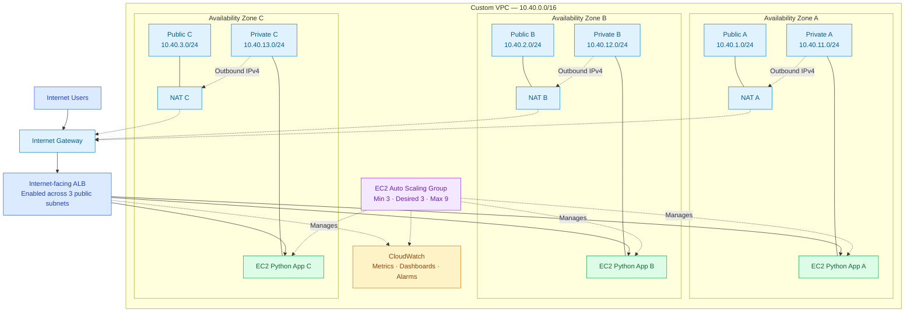

# VERIQTA SENIOR ENGINEER

# PROJECT 001: BUILD A MULTI-AZ RESILIENT INFRASTRUCTURE

# PART 00: PROJECT ORIENTATION

**Project ID:** VERIQTA-SEN-001  
**Engineering level:** Senior  
**Delivery:** Sequential follow-along portfolio project

## 00.1 Project Overview

### The engineering challenge

A service running successfully is not necessarily a resilient service.

An application may respond correctly during normal operation but become unavailable when its underlying EC2 instance fails, a deployment introduces an unhealthy target, or an entire Availability Zone experiences disruption.

In this project, you will engineer an infrastructure environment that distributes application capacity across three AWS Availability Zones. Your responsibility is not simply to deploy multiple servers. You must demonstrate that the infrastructure can detect unhealthy application instances, adjust traffic routing, maintain sufficient capacity, replace failed resources, and provide useful diagnostic evidence during a failure.

### Understanding the architecture

The project uses one custom VPC and three Availability Zones. Each AZ contains a public subnet, a private application subnet, and a NAT Gateway in its public subnet. An internet-facing Application Load Balancer is enabled across all three public subnets. An Auto Scaling Group manages private EC2 application instances, initially targeting one instance per AZ.

#### Figure 00.1 — Conceptual Multi-AZ infrastructure

*Conceptual illustration, not a packet-level network diagram. The ALB forwards incoming application traffic to eligible EC2 targets; the ASG manages instance lifecycle, and NAT Gateways provide private-subnet outbound IPv4 connectivity. Detailed network paths appear in Part 02.*

The application will expose `/` for its normal response, `/health` for health validation, and `/metadata` for safe instance and AZ diagnostics. Instance replacement requires detection, launch, bootstrap, registration and health verification; redundancy does not guarantee error-free in-flight requests or sufficient capacity during degradation.

## 00.2 Project Information

| Item | Specification |
|---|---|
| Project ID | VERIQTA-SEN-001 |
| Project title | Build a Multi-AZ Resilient Infrastructure |
| Engineering level | Senior |
| Primary platform | AWS |
| Infrastructure as Code | Terraform |
| Operating system | Ubuntu Server LTS |
| Architecture | Three Availability Zones in one AWS Region |
| Compute | Amazon EC2 |
| Traffic management | Application Load Balancer |
| Capacity management | EC2 Auto Scaling |
| Monitoring | Amazon CloudWatch |
| Application | Lightweight stateless Python HTTP service |
| Automation | Bash and Python |
| Process management | systemd |
| Instance administration | AWS Systems Manager |
| Estimated completion | 18 to 25 hours |
| Delivery method | Sequential follow-along implementation |

The estimate excludes extended failure experiments and optional improvements. Basic familiarity with Linux, AWS, networking, Terraform, Python, Bash, and Git is expected. The implementation begins from an empty repository and supplies complete source files and verification instructions in the corresponding stages.

**Cost awareness:** EC2, ALB, three NAT Gateways, public IPv4, EBS, CloudWatch and data transfer may incur charges. Review pricing and quotas before deployment; verify cleanup after destroying the lab.

## 00.3 What You Will Build

The completed infrastructure will contain:

- One custom VPC (`10.40.0.0/16`).
- Three public subnets: `10.40.1.0/24`, `10.40.2.0/24`, and `10.40.3.0/24`.
- Three private application subnets: `10.40.11.0/24`, `10.40.12.0/24`, and `10.40.13.0/24`.
- An internet gateway and one NAT Gateway per AZ, with each private subnet using its corresponding AZ NAT for outbound IPv4.
- An internet-facing ALB across the three public subnets, with listener, target group and health checks.
- An EC2 Auto Scaling Group across the private subnets (minimum 3, desired 3, maximum 9; initial placement objective one instance per AZ).
- Initial target-tracking CPU utilisation target of 60%, subject to validation.
- An Ubuntu Server LTS EC2 launch template and bootstrap automation.
- A stateless Python HTTP application with `/`, `/health`, and `/metadata` endpoints.
- IAM instance roles with restricted permissions and AWS Systems Manager management access, without requiring public SSH.
- CloudWatch metrics, dashboards and alarms.
- Automated application and infrastructure checks.
- Controlled failure experiments: F01 application process failure; F02 instance termination; F03 controlled impairment of the project's AZ-specific resources; F04 capacity saturation; F05 unhealthy application deployment.
- Capacity and recovery validation, Terraform deployment and cleanup procedures.

The AZ impairment exercise is a simulation limited to the project's own resources, not an actual AWS Availability Zone outage. Recovery timings and availability outcomes must be measured, never invented.

## 00.4 Skills You Will Develop

| Competency | Practical experience |
|---|---|
| Infrastructure architecture | Design a distributed application environment. |
| AWS networking | Configure VPCs, routes, subnets and security groups. |
| Terraform | Provision infrastructure through reusable modules. |
| High availability | Distribute resources across AZ failure domains. |
| Load balancing | Configure target groups and health checks. |
| Autoscaling | Maintain and adjust application capacity. |
| Linux operations | Bootstrap, inspect and troubleshoot EC2 instances. |
| Observability | Collect infrastructure and application evidence. |
| Failure engineering | Conduct controlled infrastructure failure experiments. |
| Incident investigation | Diagnose unhealthy targets and service degradation. |
| Capacity planning | Evaluate redundancy and remaining capacity. |
| Technical documentation | Produce a reproducible portfolio project. |

Deployment is only the beginning. You must also be able to explain health detection, request-routing changes, instance replacement, remaining capacity, and evidence-based recovery behaviour.

## 00.5 Project Boundaries

The project uses one AWS Region and three Availability Zones. Multi-region replication, disaster recovery across Regions, Kubernetes orchestration and database replication are outside the primary implementation scope.

The application is stateless so the initial exercise concentrates on infrastructure resilience rather than database consistency or distributed storage. It runs directly on EC2 and is managed by systemd and EC2 Auto Scaling.

Failure experiments must affect only authorised project resources. The project distinguishes infrastructure availability from full application availability: redundant compute cannot automatically protect against every application defect, shared dependency failure, or regional disruption. Evaluate infrastructure state, application health, request behaviour, remaining capacity, diagnostics and recovery separately.

## Part 00 Completion Checklist

- [ ] Explain why a working application is not automatically resilient.
- [ ] Identify the three AZs, six subnets, ALB, EC2 instances, NAT Gateways, ASG and CloudWatch roles.
- [ ] Explain the difference between ALB routing, ASG instance management and NAT outbound connectivity.
- [ ] Explain why health checks and remaining capacity matter during failure.
- [ ] Identify all five controlled failure experiments and their scope.
- [ ] Understand cost and cleanup responsibilities.
- [ ] Distinguish infrastructure recovery from uninterrupted request processing.

**Next: Part 01 — The Production Problem.** Examine the existing single-instance design, its failure conditions, the replacement requirements and measurable acceptance targets.
