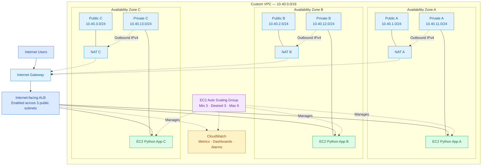

# PART 00: PROJECT ORIENTATION

## 00.1 Project Overview

### The Engineering Challenge

A service running successfully is not necessarily a resilient service.

An application may respond correctly during normal operation but become unavailable when its underlying EC2 instance fails, a deployment introduces an unhealthy target, or an entire Availability Zone experiences disruption.

Consider a customer-facing application deployed on a single EC2 instance.

During normal operation, the application responds to HTTP requests, its operating-system processes appear healthy, and the infrastructure may show no obvious signs of trouble.

However, the application depends entirely on one compute instance within one failure domain.

If that instance becomes unavailable, there is no alternative application capacity to receive incoming requests. Recovery may require an engineer to investigate the failure, provision a replacement instance, reinstall the application, restore the required configuration, and verify connectivity.

The application was functional, but its infrastructure was not designed to tolerate the loss of its only serving instance.

In this project, you will engineer an infrastructure environment that distributes application capacity across three AWS Availability Zones.

Your responsibility is not simply to deploy multiple servers. You must demonstrate that the infrastructure can:

- Detect unhealthy application instances.
- Adjust traffic routing when targets become unhealthy.
- Maintain multiple application instances across independent AZ failure domains.
- Automatically replace failed application instances.
- Adjust application capacity in response to workload demand.
- Provide useful diagnostic evidence during failure and recovery.
- Support controlled experiments that validate the architecture's behaviour.

By the end of the project, you should understand how infrastructure redundancy, application health, load balancing, autoscaling, networking, and observability work together to support service availability.

### 00.1.1 Availability, Redundancy, and Resilience

These three concepts are closely related, but they describe different engineering concerns.

Availability concerns whether a service is accessible and functioning as expected during a defined measurement period.

Redundancy means providing additional resources so that the application does not depend entirely on one component.

Resilience concerns how the system responds when components fail, capacity decreases, or operating conditions change.

Deploying three EC2 instances introduces compute redundancy, but instance count alone does not establish application resilience.

For example, three instances may all be running while their application processes are unhealthy. Similarly, two remaining instances may be healthy after the third fails but lack sufficient capacity to handle the full incoming workload.

The infrastructure must therefore be evaluated beyond the number of resources successfully provisioned.

| Engineering concern       | Question to investigate                                                           |
| ------------------------- | --------------------------------------------------------------------------------- |
| Redundancy                | Is alternative application capacity available when an instance fails?             |
| Failure isolation         | Can one AZ-specific failure occur without removing every application instance?    |
| Health detection          | How does the load balancer determine whether an application target is healthy?    |
| Traffic management        | What happens to incoming requests when a target becomes unhealthy?                |
| Automated recovery        | How does the infrastructure replace failed application instances?                 |
| Capacity management       | Can the remaining instances support the workload during degradation?              |
| Observability             | What evidence is available to explain the incident?                               |
| Operational repeatability | Can deployment, validation, investigation, and cleanup be performed consistently? |

These concerns form the foundation of the implementation and failure experiments developed throughout the project.

### 00.1.2 Introducing the Target Infrastructure

The replacement infrastructure will operate within one AWS Region and use three Availability Zones.

A custom Virtual Private Cloud will provide the network boundary for the environment.

Each Availability Zone will contain one public subnet and one private application subnet.

An internet-facing Application Load Balancer will be enabled across the three public subnets, while the Python application will run on EC2 instances inside the private subnets.

An EC2 Auto Scaling Group will manage the application instances across the three Availability Zones.

The initial configuration will maintain a desired capacity of three instances, with an initial placement objective of one instance per Availability Zone.

Each private subnet will also use a NAT Gateway located in its corresponding Availability Zone for the required outbound IPv4 connectivity.

The following conceptual diagram introduces the approved infrastructure.

### Figure 00.1 — Conceptual Multi-AZ Infrastructure Architecture

Figure 00.1: Conceptual view of the approved three-AZ infrastructure. Solid arrows identify the principal incoming application traffic path. Dashed arrows identify supporting outbound connectivity, instance management, and monitoring relationships. Lines connecting subnet and resource boxes indicate containment or association, not additional traffic hops.

This is an orientation diagram, not a complete packet-level representation of AWS networking. The detailed network architecture, route tables, security boundaries, and request flow will be developed in Part 02.

Two distinctions are particularly important:

First, the Application Load Balancer distributes incoming requests to eligible application targets. The Auto Scaling Group manages the instance lifecycle and capacity; it does not sit in the HTTP request path.

Second, the NAT Gateways provide outbound connectivity for private subnets. Incoming application requests do not travel through them.

### 00.1.3 How the Application Will Behave

The application will be a lightweight, stateless Python HTTP service.

It will expose three endpoints.

| Endpoint    | Responsibility                                                               |
| ----------- | ---------------------------------------------------------------------------- |
| `/`         | Returns a normal application response.                                       |
| `/health`   | Supports application health validation.                                      |
| `/metadata` | Returns safe instance identity and Availability Zone diagnostic information. |

The metadata endpoint is particularly useful for investigating this architecture.

Because application instances will operate across different Availability Zones, identifying the instance that processed a request will help you observe request distribution and changes in available serving capacity.

During normal operation, a client sends an HTTP request to the Application Load Balancer. The load balancer forwards the request to an eligible target in a private application subnet, and the application processes the request.

During a failure, the infrastructure must detect unhealthy targets, adjust traffic routing according to its configured behaviour, and initiate the necessary recovery actions.

However, these operations are not instantaneous.

A replacement EC2 instance must launch, complete bootstrap, start the application, register with the target group, and satisfy the configured health requirements.

The remaining instances must therefore have enough capacity to support the workload while recovery takes place.

You will investigate this behaviour during the project's capacity and failure experiments.

### 00.1.4 What You Must Demonstrate

A successful Terraform deployment is only the beginning of this project.

You must also demonstrate that the infrastructure behaves according to its defined engineering requirements.

For example, when an application instance becomes unhealthy, you should be able to investigate:

1. How the failure was detected.
2. How target health changed.
3. Whether incoming requests experienced errors.
4. Whether the Auto Scaling Group initiated replacement.
5. How long the replacement process took.
6. Whether the remaining instances supported the defined workload.
7. Which monitoring information helped explain the incident.
8. Whether the environment returned to its expected operating state.

You will collect actual measurements during implementation and testing.

Do not treat the existence of redundant resources as proof that application availability has been achieved.

## 00.2 Project Information

### Project Specification

| Item                    | Specification                             |
| ----------------------- | ----------------------------------------- |
| Project ID              | VERIQTA-SEN-001                           |
| Project title           | Build a Multi-AZ Resilient Infrastructure |
| Engineering level       | Senior                                    |
| Project category        | Advanced Infrastructure Engineering       |
| Primary platform        | AWS                                       |
| Infrastructure as Code  | Terraform                                 |
| Operating system        | Ubuntu Server LTS                         |
| Architecture            | Three Availability Zones                  |
| Compute                 | Amazon EC2                                |
| Traffic management      | Application Load Balancer                 |
| Capacity management     | EC2 Auto Scaling                          |
| Monitoring              | Amazon CloudWatch                         |
| Application             | Lightweight Python HTTP service           |
| Automation              | Bash and Python                           |
| Process management      | systemd                                   |
| Instance administration | AWS Systems Manager                       |
| Source control          | Git and GitHub                            |
| Estimated completion    | 18 to 25 hours                            |
| Delivery method         | Sequential follow-along implementation    |

The estimated completion time excludes extended failure experiments and optional architecture improvements.

### 00.2.1 Expected Background Knowledge

This project assumes that you already understand basic Linux administration, AWS infrastructure, networking, and Infrastructure as Code.

You do not need an existing application or infrastructure repository. The implementation will begin from an empty working directory.

However, familiarity with the following concepts will help you understand the engineering decisions made throughout the project.

| Knowledge area | Expected understanding                                          |
| -------------- | --------------------------------------------------------------- |
| Linux          | Files, directories, permissions, processes, services, and logs  |
| AWS            | Regions, Availability Zones, EC2, VPC, IAM, and security groups |
| Networking     | IP addresses, CIDR notation, routing, TCP ports, and HTTP       |
| Terraform      | Providers, resources, variables, outputs, plans, and state      |
| Python         | Basic application structure and HTTP responses                  |
| Bash           | Executing shell commands and understanding automation scripts   |
| Git            | Repository initialisation, commits, and basic source control    |

The implementation stages will provide the required configuration files, commands, scripts, expected results, and verification procedures.

### 00.2.2 AWS Cost Considerations

This project uses real AWS infrastructure and may generate charges while resources remain deployed.

Potential billable resources include:

- EC2 instances.
- Application Load Balancer usage.
- NAT Gateways and data processing.
- Public IPv4 addresses.
- EBS storage.
- CloudWatch logs, metrics, dashboards, and alarms.
- Network data transfer.

The baseline design uses one NAT Gateway per Availability Zone. This reduces deliberate dependence on a single cross-AZ NAT Gateway but introduces additional infrastructure cost.

Before provisioning the environment, you will review the selected AWS Region, resource configuration, service quotas, and expected costs.

The implementation will also include Terraform cleanup and additional verification procedures to identify unintended remaining billable lab resources.

## 00.3 What You Will Build

Your completed infrastructure will contain the following components.

### 00.3.1 Custom Virtual Private Cloud

You will provision one custom Amazon VPC using Terraform.

The approved VPC address space is:

`10.40.0.0/16`

The VPC will provide the network boundary for the application infrastructure and contain the public and private subnets distributed across three Availability Zones.

### 00.3.2 Three Public Subnets

You will create one public subnet in each Availability Zone.

The approved address allocation is:

| Subnet          | CIDR           |
| --------------- | -------------- |
| Public Subnet A | `10.40.1.0/24` |
| Public Subnet B | `10.40.2.0/24` |
| Public Subnet C | `10.40.3.0/24` |

These subnets will support the internet-facing Application Load Balancer and the NAT Gateways required by the baseline network design.

### 00.3.3 Three Private Application Subnets

You will create one private application subnet in each Availability Zone.

| Subnet           | CIDR            |
| ---------------- | --------------- |
| Private Subnet A | `10.40.11.0/24` |
| Private Subnet B | `10.40.12.0/24` |
| Private Subnet C | `10.40.13.0/24` |

The application instances will run inside these private subnets.

They will not require directly assigned public IPv4 addresses to serve requests through the Application Load Balancer.

### 00.3.4 Internet Gateway and NAT Gateways

The VPC will contain an internet gateway supporting the required public connectivity.

You will also provision one NAT Gateway per Availability Zone.

Each private application subnet will use the NAT Gateway located in its corresponding Availability Zone for the required outbound IPv4 connectivity.

The associated route tables will be managed through Terraform.

### 00.3.5 Internet-Facing Application Load Balancer

You will configure an Application Load Balancer across the three public subnets.

It will provide the public application entry point and distribute requests to eligible application targets.

Its configuration will include:

- A listener.
- An application target group.
- Target health checks.
- The required security group configuration.
- Integration with the EC2 Auto Scaling Group.

### 00.3.6 EC2 Auto Scaling Group

The application instances will be managed by an EC2 Auto Scaling Group spanning the three private subnets.

The approved initial capacity configuration is:

| Parameter                            | Initial configuration |
| ------------------------------------ | --------------------- |
| Minimum capacity                     | 3                     |
| Desired capacity                     | 3                     |
| Maximum capacity                     | 9                     |
| Enabled Availability Zones           | 3                     |
| Initial placement objective          | One instance per AZ   |
| Scaling mechanism                    | Target tracking       |
| Primary application health mechanism | ALB target health     |

An initial CPU utilisation target of 60% will be used for the scaling exercise, subject to testing and validation.

These values establish an implementation baseline. They do not guarantee that the environment can support every workload or remain unaffected by the loss of an Availability Zone.

### 00.3.7 EC2 Launch Template

You will configure a launch template defining the application instance configuration.

It will include the selected Ubuntu Server LTS image, compute configuration, instance profile, security settings, and bootstrap instructions.

The launch template will support consistent instance creation and automated replacement.

### 00.3.8 Lightweight Python HTTP Application

You will develop a stateless Python application exposing the following endpoints:

| Endpoint    | Purpose                                     |
| ----------- | ------------------------------------------- |
| `/`         | Normal application response                 |
| `/health`   | Application health validation               |
| `/metadata` | Safe instance and AZ diagnostic information |

The application will be managed using systemd on the EC2 instances.

It will not require database replication or persistent server-side session storage.

### 00.3.9 IAM Instance Roles and Management Access

You will configure IAM roles and instance profiles with permissions restricted to the requirements of the project.

AWS Systems Manager will provide the planned instance management approach without requiring public SSH access, subject to the necessary permissions and network connectivity.

Permanent AWS credentials must not be embedded in application source code, bootstrap scripts, or committed configuration files.

### 00.3.10 CloudWatch Monitoring, Dashboards, and Alarms

You will establish monitoring for the deployed infrastructure.

The monitoring configuration will cover relevant Application Load Balancer, EC2, and Auto Scaling metrics.

You will investigate indicators including:

- Healthy and unhealthy application target counts.
- Request behaviour.
- Target response time.
- Instance CPU utilisation.
- Auto Scaling capacity and instance activity.
- Important alarm conditions.

These measurements will support the project's failure investigations and final acceptance testing.

### 00.3.11 Automated Application Health Checks

You will configure application-level health checks through the load balancer.

Additional validation procedures will help distinguish between an EC2 instance that is running and an application instance that is actually ready to process requests.

### 00.3.12 Infrastructure Failure Simulation Scripts

You will develop controlled failure experiments covering five scenarios.

| ID  | Failure experiment                  | Engineering objective                                                        |
| --- | ----------------------------------- | ---------------------------------------------------------------------------- |
| F01 | Application process failure         | Investigate health detection and target removal.                             |
| F02 | EC2 instance termination            | Observe automated instance replacement.                                      |
| F03 | Controlled AZ impairment simulation | Examine traffic redistribution and remaining capacity.                       |
| F04 | Increased application load          | Investigate capacity saturation and autoscaling behaviour.                   |
| F05 | Unhealthy application deployment    | Examine how the infrastructure responds to failed application health checks. |

The AZ impairment experiment will affect only the project's own resources. It will not attempt to disrupt AWS-managed Availability Zone infrastructure or claim to reproduce every characteristic of a real AZ outage.

### 00.3.13 Capacity and Recovery Validation

You will evaluate the infrastructure under normal and degraded operating conditions.

This includes investigating whether the remaining instances can support the defined test workload after an instance or AZ-specific impairment.

You will measure and record actual recovery behaviour rather than assume that automated replacement guarantees uninterrupted request processing.

### 00.3.14 Terraform-Managed Deployment and Cleanup

Terraform will manage the infrastructure throughout the project.

You will use it to provision resources, inspect proposed changes, validate configurations, and destroy the environment.

The project will also include cleanup verification procedures to identify resources that might remain after the primary Terraform destruction process.

## 00.4 Skills You Will Develop

This project is designed to strengthen practical engineering skills across architecture, infrastructure implementation, operations, and failure investigation.

| Competency                  | Practical experience                                                          |
| --------------------------- | ----------------------------------------------------------------------------- |
| Infrastructure architecture | Design a distributed application environment across three Availability Zones. |
| AWS networking              | Configure VPCs, routes, subnets, gateways, and security groups.               |
| Terraform                   | Provision infrastructure through reusable modules.                            |
| High availability           | Distribute resources across independent AZ failure domains.                   |
| Load balancing              | Configure target groups and health checks.                                    |
| Autoscaling                 | Maintain and adjust application capacity.                                     |
| Linux operations            | Bootstrap, inspect, and troubleshoot EC2 instances.                           |
| Observability               | Collect infrastructure and application evidence.                              |
| Failure engineering         | Conduct controlled infrastructure failure experiments.                        |
| Incident investigation      | Diagnose unhealthy targets and service degradation.                           |
| Capacity planning           | Evaluate redundancy and remaining capacity.                                   |
| Technical documentation     | Produce a reproducible portfolio project.                                     |

### Demonstrating Engineering Competence

Completing the deployment is only one part of the exercise.

You should also be able to explain why the infrastructure was designed in a particular way.

For example, you should understand why application instances are placed in private subnets, why the load balancer is enabled across multiple Availability Zones, and why the Auto Scaling Group is responsible for instance lifecycle management.

You should also be able to explain the difference between detecting an unhealthy application target, changing request routing, replacing an instance, and restoring sufficient application capacity.

During the failure experiments, you will collect evidence that helps explain these behaviours.

The completed repository should demonstrate not only that you can provision AWS resources, but also that you can investigate their operational behaviour and document the limitations of the architecture.

## 00.5 Project Boundaries

A clearly defined scope helps keep the project focused on its primary engineering objective.

Project 001 concentrates on infrastructure resilience within one AWS Region.

### 00.5.1 Single-Region Architecture

The project uses three Availability Zones within one AWS Region.

The objective is to reduce dependence on an individual AZ failure domain.

Multi-region replication and disaster recovery across Regions are outside the primary implementation scope.

A regional disruption or failure of a shared dependency may still affect the application.

### 00.5.2 Stateless Application

The project uses a stateless Python application so that the initial implementation concentrates on infrastructure resilience rather than database consistency or distributed storage.

Database replication, distributed storage, and stateful application recovery are not included in the baseline implementation.

### 00.5.3 No Kubernetes Orchestration

The application will run directly on EC2 instances.

You will use systemd for application process management and EC2 Auto Scaling for instance lifecycle and capacity management.

Kubernetes orchestration is outside the scope of this project.

### 00.5.4 Controlled Failure Experiments

All failure experiments must remain within the AWS resources provisioned for this project.

The experiments must not disrupt unrelated infrastructure or resources that you do not have permission to test.

Each experiment will include defined starting conditions, failure introduction, diagnostic investigation, recovery procedures, and verification.

### 00.5.5 Infrastructure Availability Is Not Full Application Availability

A resilient compute environment cannot automatically protect against every application defect, shared dependency failure, or regional disruption.

For example, three EC2 instances might be running successfully while all three application processes are unhealthy because of the same configuration error.

Similarly, an Auto Scaling Group may successfully replace a failed instance while some requests experience errors during health detection or connection termination.

The project will therefore evaluate infrastructure state and actual application behaviour separately.

Your final assessment must consider:

- Infrastructure availability.
- Application health.
- Request behaviour.
- Remaining application capacity.
- Diagnostic evidence.
- Recovery behaviour.

The objective is to establish what the infrastructure can demonstrably tolerate under the tested conditions, rather than assume that resource redundancy guarantees uninterrupted service.

## PART 00: COMPLETION CHECKLIST

Before moving to Part 01, confirm that you understand the engineering problem and the boundaries of the approved project.

- I understand why a successfully deployed application is not automatically resilient.
- I understand the purpose of distributing application capacity across three Availability Zones.
- I can identify the main infrastructure components in the approved architecture.
- I understand the separate responsibilities of the Application Load Balancer and Auto Scaling Group.
- I understand why application-level health checks are necessary.
- I understand the purpose of the private application subnets.
- I understand the role of the NAT Gateways in the approved network design.
- I understand why monitoring and diagnostic evidence are required.
- I understand that infrastructure recovery and uninterrupted request processing are different measurements.
- I understand the five planned failure experiments.
- I understand the project's cost considerations and cleanup requirements.
- I understand the limitations of the single-region, stateless architecture.

### What Comes Next

Part 01: The Production Problem

In the next part, you will examine the existing single-instance architecture, identify its failure points, define the engineering requirements for the replacement infrastructure, and establish measurable acceptance targets.

Those requirements will provide the foundation for the detailed architecture and implementation decisions developed in Part 02.

