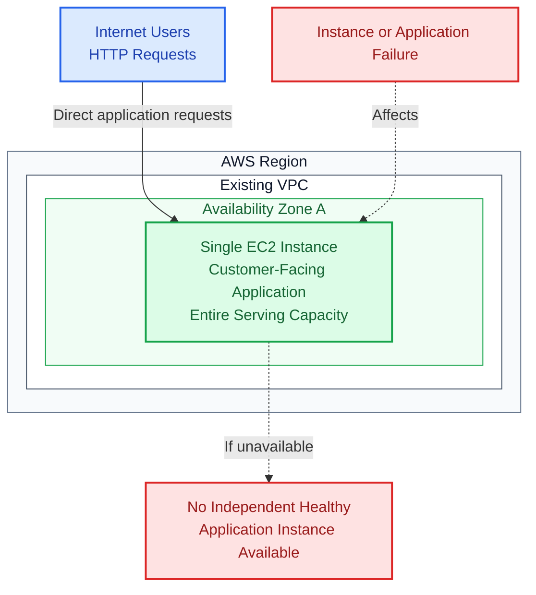
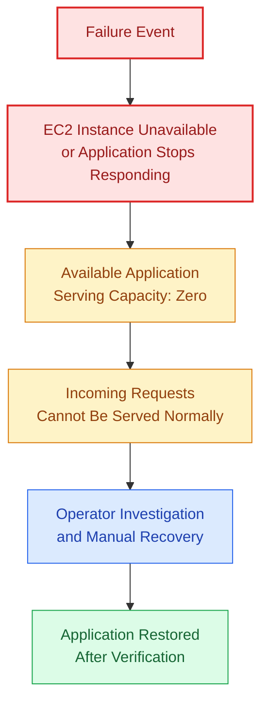
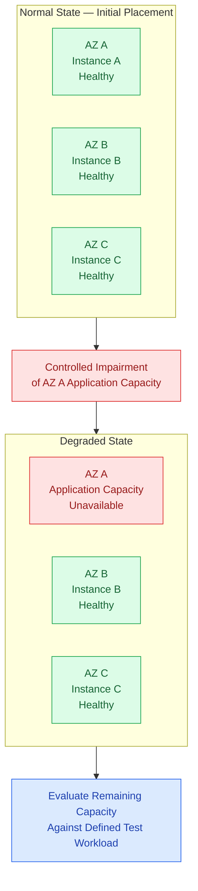

# VERIQTA SENIOR ENGINEER
## PROJECT 001: BUILD A MULTI-AZ RESILIENT INFRASTRUCTURE

# PART 01: THE PRODUCTION PROBLEM

**Project ID:** VERIQTA-SEN-001  
**Engineering level:** Senior  
**GitHub destination:** `docs/01-production-scenario.md`  
**Engineering focus:** Existing infrastructure, failure analysis, requirements, capacity risk, and acceptance targets.

---

## 01.1 Production Scenario

### The existing production environment

You are responsible for the infrastructure supporting a customer-facing application. The application currently runs on a single Amazon EC2 instance inside one AWS Availability Zone. Incoming HTTP requests reach that instance directly, and the application operates normally under expected traffic conditions.

At first glance, the deployment appears sufficient: customers can access the application and routine infrastructure checks may indicate that the instance is running. However, the entire application serving capacity depends on one compute instance in one Availability Zone.

If the instance becomes unavailable, there is no independent healthy application instance ready to receive traffic. The existing infrastructure also lacks an independent replacement mechanism; recovering from a failed instance requires manual intervention.

The engineering team has asked you to redesign the environment to tolerate individual application instance failures and reduce dependence on any single Availability Zone. Your assignment is to **design, provision, validate, and document** the replacement architecture.

### 01.1.1 Understanding the assignment

The solution is not simply to migrate to a larger EC2 instance. A larger instance can provide more compute resources, but it remains one failure point. Likewise, creating multiple instances without health-aware routing, automated replacement, and capacity validation does not satisfy the requirements.

| Existing limitation | Required improvement |
|---|---|
| One application instance | Multiple application instances |
| One Availability Zone | Distribution across three AZs |
| Direct instance access | Public application entry through an ALB |
| No independent serving capacity | Alternative healthy application targets |
| Manual replacement | EC2 Auto Scaling lifecycle management |
| Limited failure visibility | CloudWatch and diagnostic evidence |
| No defined resilience validation | Controlled failure and recovery experiments |
| No demonstrated degraded-state capacity | Capacity testing against a defined workload |

### 01.1.2 Questions during an incident

When the existing application stops responding, an engineer must determine whether the instance is running, whether the operating system and application process are responsive, whether resource saturation or a recent deployment caused the problem, whether the Availability Zone is affected, and how the service can be restored. There is no independent application target to absorb traffic during this investigation.

---

## 01.2 Existing Architecture

### 01.2.1 Initial infrastructure

The original scenario specifies one EC2 application instance inside one AZ, with incoming requests reaching the instance directly. It does not specify the original subnet, public IP arrangement, NAT, or monitoring resources; the diagram therefore does not invent them.

### Figure 01.1 — Existing single-instance architecture

**Figure 01.1:** One instance provides all application serving capacity. The diagram shows the logical application dependency, not unspecified details of the original networking.

### 01.2.2 Single point of failure

A single point of failure is a component whose loss can prevent a system from delivering its required function because no suitable alternative is available. In this scenario, the EC2 instance is a single point of failure for application serving capacity. Because all application capacity is also located in one AZ, an AZ disruption affecting that instance may remove the complete service.

### 01.2.3 Problems with the existing design

| Failure condition | Potential impact |
|---|---|
| EC2 instance termination | Application becomes unavailable. |
| Application process crash | Requests fail until the service recovers. |
| Availability Zone disruption | Entire application capacity may be lost. |
| Unexpected traffic increase | The single instance may become saturated. |
| Unhealthy deployment | No healthy alternative instance is available. |
| Manual replacement delay | Recovery depends on operator intervention. |

### 01.2.4 Failure propagation

### Figure 01.2 — Existing failure propagation

**Figure 01.2:** Without independent serving capacity, an instance or application failure can become a service-wide incident. No specific recovery duration is assumed.

### 01.2.5 Why increasing instance size is insufficient

A larger EC2 instance might support more normal traffic, but it can still terminate, become unresponsive, run an unhealthy deployment, or be affected by its AZ. The redesign must introduce independent serving capacity rather than rely exclusively on vertical scaling.

---

## 01.3 Engineering Requirements

### 01.3.1 Availability

- Distribute application instances across three Availability Zones.
- Maintain multiple healthy application instances.
- Route requests through an Application Load Balancer.
- Stop directing new requests to targets identified as unhealthy, subject to documented load-balancer health and routing behaviour.
- Automatically replace failed application instances.

Distribution reduces dependency on one AZ but does not itself guarantee uninterrupted application availability. Failure testing must establish actual behaviour.

### 01.3.2 Networking

- Keep application instances inside private subnets.
- Expose only the ALB to incoming public application traffic.
- Restrict application access through security groups.
- Provide controlled outbound connectivity for bootstrap and required AWS services.

The approved network design uses one custom VPC, three public subnets, and three private subnets. Each private subnet uses the NAT Gateway in its corresponding AZ for baseline outbound IPv4 connectivity. AWS Systems Manager is the planned management approach; public SSH is not required.

### 01.3.3 Capacity

- Maintain a normal minimum configured capacity of three application instances.
- Support automatic capacity adjustments.
- Evaluate whether remaining capacity supports the defined workload after one AZ's application capacity is impaired.
- Do not treat instance count alone as proof of adequate capacity.

| Approved initial parameter | Value |
|---|---:|
| Minimum capacity | 3 |
| Desired capacity | 3 |
| Maximum capacity | 9 |
| Enabled AZs | 3 |
| Initial placement objective | One instance per AZ |
| Initial CPU target-tracking value | 60%, subject to validation |

With three equally sized and equally loaded instances, losing one removes approximately one-third of initial compute capacity until replacement or scaling occurs. The remaining two instances must have sufficient headroom for the test workload; this is a question to measure, not a guarantee.

### Figure 01.3 — Initial and degraded application capacity

**Figure 01.3:** Controlled impairment of the project's AZ A application capacity, not a real AWS Availability Zone outage. Whether the remaining instances can handle the workload must be validated.

### 01.3.4 Observability

- Monitor healthy and unhealthy target counts.
- Monitor application response behaviour.
- Collect relevant EC2 and Auto Scaling metrics.
- Establish alarms for important service conditions.
- Capture evidence during controlled failure experiments.

The monitoring design must help distinguish a running EC2 instance, a healthy application target, and a service successfully processing requests.

### 01.3.5 Operations

- Deploy the infrastructure using Terraform.
- Avoid manual resource creation where automation is practical.
- Provide reproducible failure simulations.
- Document investigation and recovery procedures.
- Support complete environment cleanup.

### 01.3.6 Requirements traceability

These identifiers are documentation aids, not new infrastructure components.

| ID | Requirement | Planned verification |
|---|---|---|
| AV-01 | Capacity spans three AZs | Inspect subnet and instance distribution |
| AV-02 | Multiple healthy instances | Inspect ASG capacity and ALB target health |
| AV-03 | Incoming requests use ALB | Verify ALB application endpoint |
| AV-04 | Unhealthy targets are detected | Conduct application failure experiment |
| AV-05 | Failed instances are replaced | Conduct controlled instance termination |
| NET-01 | Application instances are private | Inspect instance networking |
| NET-02 | ALB is public application entry | Inspect networking and security |
| NET-03 | Application access is restricted | Inspect security group rules |
| NET-04 | Required outbound access works | Verify bootstrap and AWS service access |
| CAP-01 | Minimum configured capacity is three | Inspect ASG configuration |
| CAP-02 | Automatic capacity adjustment | Run controlled scaling test |
| CAP-03 | Remaining capacity is tested | Compare degraded state against workload |
| OBS-01 | Metrics and dashboards are available | Inspect CloudWatch |
| OBS-02 | Important conditions have alarms | Inspect alarms |
| OBS-03 | Failure evidence is captured | Review experiment records |
| OPS-01 | Terraform deployment is reproducible | Validate configuration and procedure |
| OPS-02 | Failure tests are reproducible | Execute documented scenarios |
| OPS-03 | Investigation and recovery are documented | Review operational documentation |
| OPS-04 | Lab resources can be cleaned up | Run cleanup verification |

---

## 01.4 Proposed Acceptance Targets

These are **project acceptance targets, not guarantees of AWS service behaviour**.

| Measurement | Project target |
|---|---|
| Availability Zone distribution | Three AZs |
| Normal minimum application capacity | Three EC2 instances |
| Instance replacement | Automatically initiated by Auto Scaling |
| Application health | Verified through ALB health checks |
| Instance failure recovery | Measure and record actual recovery time |
| AZ impairment | Demonstrate continued service through healthy remaining AZs |
| Capacity after AZ impairment | Validate against the defined test workload |
| Infrastructure deployment | Reproducible using Terraform |
| Infrastructure cleanup | No unintended billable lab resources remain |

### 01.4.1 Recovery is not uninterrupted request processing

An Auto Scaling Group may successfully replace an instance while some requests still experience errors during health detection or connection termination. The ALB may continue routing to healthy targets while those targets experience increased workload pressure. Infrastructure recovery and customer-visible application behaviour must be evaluated separately.

### 01.4.2 Measurements to capture

| Measurement | Evidence to record |
|---|---|
| Healthy baseline | Initial target health and application capacity |
| Failure introduction | Time and method of controlled impairment |
| Health detection | Observed target-health transition |
| Request behaviour | Successes, errors, and response behaviour |
| Replacement activity | ASG activity and instance lifecycle |
| Application recovery | Time replacement becomes healthy |
| Remaining capacity | Resource utilisation and degraded-state response |
| Final state | Return to expected operating condition |

Do not report an availability percentage, recovery time, or successful experiment before it has actually been observed. If an acceptance test fails, document the observed result and investigate it rather than rewriting the target to imply success.

### 01.4.3 Evidence-based acceptance

A successful Terraform apply is not the end of validation. Verify the application through the ALB, inspect AZ distribution and target health, observe replacement activity, evaluate remaining capacity, and document the controlled failure experiments.

---

## PART 01: COMPLETION CHECKLIST

- [ ] I can explain the existing single-instance architecture.
- [ ] I can identify the EC2 instance as a single point of failure.
- [ ] I understand the impact of a single-AZ dependency.
- [ ] I understand why a larger instance does not remove that dependency.
- [ ] I can explain the replacement architecture's availability requirements.
- [ ] I understand why application instances will run in private subnets.
- [ ] I understand the initial ASG capacity configuration.
- [ ] I understand why instance count is not sufficient proof of capacity.
- [ ] I can identify the monitoring and diagnostic requirements.
- [ ] I understand Terraform deployment and cleanup requirements.
- [ ] I understand the proposed acceptance targets.
- [ ] I understand why actual recovery measurements must be recorded.

### What Comes Next

**Part 02: Architecture and Engineering Design** translates these requirements into the approved three-AZ architecture, network design, request flow, application capacity configuration, engineering decisions, and five controlled failure scenarios.
