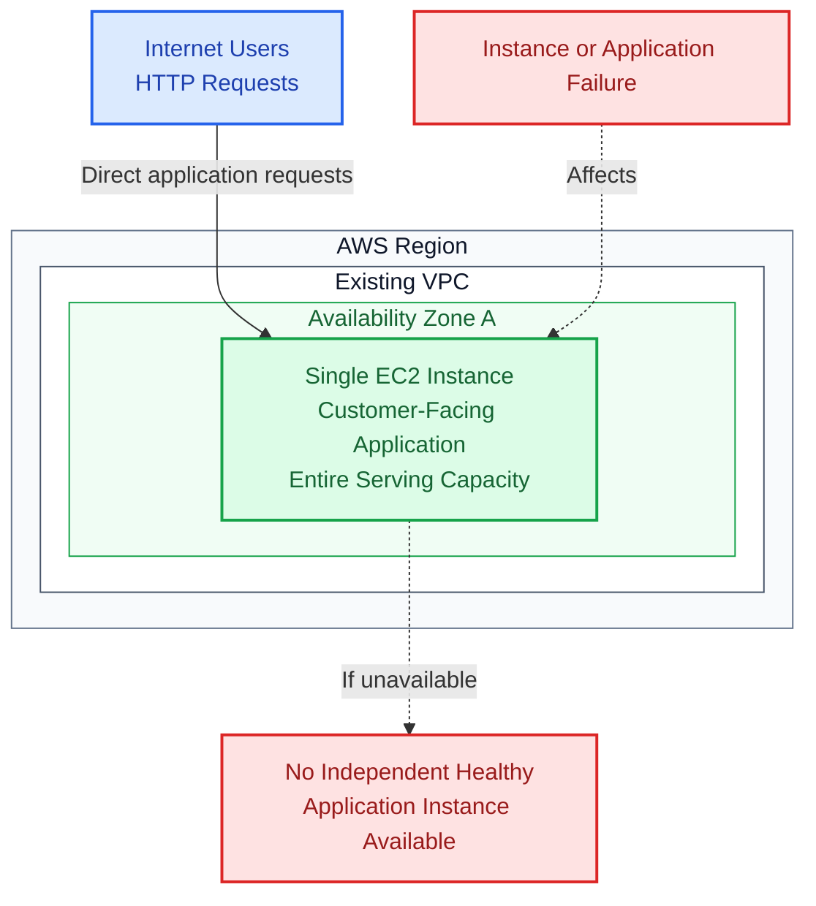
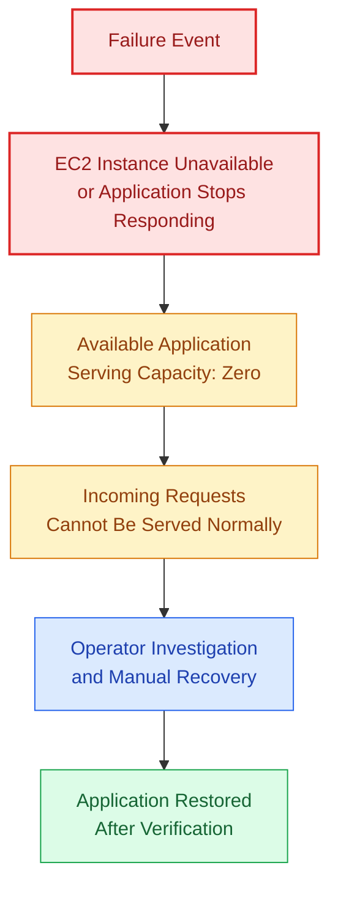
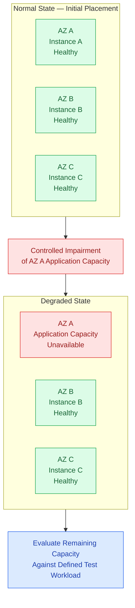

# PART 01: THE PRODUCTION PROBLEM

## 01.1 Production Scenario

### The Existing Production Environment

You are responsible for the infrastructure supporting a customer-facing application.

The application currently runs on a single Amazon EC2 instance inside one AWS Availability Zone. Incoming HTTP requests reach that instance directly, and the application operates normally under expected traffic conditions.

At first glance, the deployment appears sufficient. Customers can access the application, its primary functions work, and routine infrastructure checks may indicate that the EC2 instance is running.

However, the environment has a significant architectural weakness: the application's entire serving capacity depends on one compute instance in one Availability Zone.

If the instance becomes unavailable, there is no independent application instance ready to receive incoming traffic.

The environment also lacks an automated mechanism for maintaining replacement application capacity. Recovering from an instance failure requires operator intervention.

The engineering team has therefore been asked to redesign the infrastructure to tolerate individual application instance failures and reduce dependence on any single Availability Zone.

Your assignment is to design, provision, validate, and document that replacement architecture.

### 01.1.1 Understanding the Assignment

The objective is not to migrate the application to a larger EC2 instance.

Increasing the size of the existing instance might provide additional compute capacity, but it would not remove the dependency on that instance.

Similarly, creating three EC2 instances without establishing health-aware traffic management, automated replacement, and appropriate network isolation would not satisfy the project's engineering requirements.

The replacement must address several connected problems:

| Existing limitation                     | Required engineering improvement               |
| --------------------------------------- | ---------------------------------------------- |
| One application instance                | Multiple application instances                 |
| One Availability Zone                   | Distribution across three AZs                  |
| Direct access to the instance           | Central application entry point through an ALB |
| No independent serving capacity         | Healthy alternative application targets        |
| Manual instance replacement             | EC2 Auto Scaling lifecycle management          |
| Limited failure visibility              | CloudWatch monitoring and diagnostic evidence  |
| No defined resilience validation        | Controlled failure and recovery experiments    |
| No demonstrated degraded-state capacity | Capacity testing against a defined workload    |

These improvements will be implemented using the approved Project 001 architecture established in Part 00.

### 01.1.2 The Operational Questions

Before designing the replacement, consider the questions an engineer would need to answer during an incident affecting the existing environment.

- Is the EC2 instance still running?
- Is the operating system responsive?
- Is the application process running?
- Is the application accepting HTTP requests?
- Is the instance experiencing resource saturation?
- Did a recent deployment introduce the failure?
- Is the underlying Availability Zone experiencing disruption?
- How will the application be restored if the instance cannot recover?
- How long will customers remain affected?

The current architecture offers no independent application target to absorb traffic while these questions are investigated.

This is why the redesign must address both failure tolerance and recovery.

## 01.2 Existing Architecture

### 01.2.1 Initial Infrastructure

The starting environment consists of an application running on one EC2 instance inside a single Availability Zone.

Incoming requests reach the instance directly.

The following diagram represents the logical arrangement described in the production scenario. It deliberately does not invent an existing NAT Gateway, load balancer, monitoring configuration, or other network resources that the original scenario does not specify.

### Figure 01.1 — Existing Single-Instance Architecture

Figure 01.1: The existing application's entire serving capacity depends on one EC2 instance. The diagram illustrates the logical application dependency, not an assertion about the original environment's unspecified public-IP or subnet configuration.

### 01.2.2 Identifying the Single Point of Failure

A single point of failure is a component whose loss can prevent the system from delivering its required function because no suitable alternative is available.

In the existing architecture, the EC2 instance is a single point of failure for application serving capacity.

The instance hosts the application process and represents the only available destination for incoming requests.

An incident affecting the instance can therefore affect the entire application.

The same concern applies to its Availability Zone. Because no application capacity exists in another AZ, an AZ disruption affecting the instance can remove the application's complete serving capacity.

The replacement architecture must address these dependencies through distributed application instances and automated infrastructure management.

### 01.2.3 Problems with the Existing Design

The following failure conditions are within the scope of the project.

| Failure condition            | Potential impact                                                                      |
| ---------------------------- | ------------------------------------------------------------------------------------- |
| EC2 instance termination     | The application becomes unavailable because no replacement serving instance is ready. |
| Application process crash    | Requests fail until the application service recovers.                                 |
| Availability Zone disruption | The application's entire compute capacity may be lost.                                |
| Unexpected traffic increase  | The single instance may become saturated.                                             |
| Unhealthy deployment         | There is no healthy alternative application instance.                                 |
| Manual replacement delay     | Recovery depends on operator intervention.                                            |

These conditions have different causes, but the architectural consequence is similar: the application has no independently available serving capacity.

### 01.2.4 Failure Propagation in the Existing Environment

The following diagram illustrates how an instance-level problem can become a service-wide incident.

### Figure 01.2 — Existing Failure Propagation

Figure 01.2: The existing architecture has no independent application instance to maintain service while the affected instance is investigated or replaced. The exact recovery duration is unknown and must not be assumed.

### 01.2.5 Why Increasing Instance Size Is Insufficient

A larger EC2 instance could improve the application's ability to handle normal workload demand.

However, increasing instance size does not eliminate the original failure dependency.

A larger instance can still:

- Experience an operating-system failure.
- Become unavailable.
- Run an unhealthy application deployment.
- Encounter application process failures.
- Be affected by disruption in its Availability Zone.

The redesign must therefore introduce independent serving capacity rather than rely exclusively on increasing the capacity of the existing instance.

## 01.3 Engineering Requirements

The replacement infrastructure must satisfy the following requirements.

These requirements will guide the architecture in Part 02 and provide the basis for implementation and acceptance testing.

### 01.3.1 Availability Requirements

The infrastructure must:

- Distribute application instances across three Availability Zones.
- Maintain multiple healthy application instances.
- Route incoming requests through an Application Load Balancer.
- Stop directing new requests to targets identified as unhealthy, subject to the load balancer's documented routing and health behaviour.
- Automatically replace failed application instances.

The intended result is to reduce the application's dependence on any individual EC2 instance or Availability Zone.

However, distributing infrastructure across multiple AZs does not automatically guarantee uninterrupted application availability.

The capacity and failure experiments must demonstrate how the deployed environment actually behaves.

### 01.3.2 Networking Requirements

The replacement must:

- Run application instances inside private subnets.
- Expose only the Application Load Balancer to incoming public application traffic.
- Restrict application access through security groups.
- Provide controlled outbound connectivity for instance bootstrap and required AWS services.

The approved network design uses one custom VPC, three public subnets, and three private application subnets.

Each private subnet will use a NAT Gateway located in its corresponding Availability Zone for the baseline outbound IPv4 configuration.

Administrative access will use AWS Systems Manager rather than require publicly exposed SSH access.

### 01.3.3 Capacity Requirements

The infrastructure must:

- Maintain a minimum configured capacity of three application instances during normal operation.
- Support automatic capacity adjustments.
- Evaluate whether the remaining infrastructure can support the defined workload after losing application capacity in one Availability Zone.
- Avoid treating instance count alone as proof of sufficient capacity.

The approved initial Auto Scaling configuration is:

| Parameter                         | Value |
| --------------------------------- | ----- |
| Minimum capacity                  | 3     |
| Desired capacity                  | 3     |
| Maximum capacity                  | 9     |
| Initial CPU target-tracking value | 60%   |
| Enabled Availability Zones        | 3     |

The initial placement objective is one application instance per Availability Zone.

These settings establish a starting configuration for implementation and experimentation. They do not constitute a verified capacity guarantee.

#### Understanding Remaining Capacity

Consider the initial deployment with three equally sized application instances.

If one instance becomes unavailable, approximately one-third of the original compute capacity is lost until replacement or scaling restores capacity.

The remaining two instances must temporarily handle the incoming workload.

This introduces an important distinction between infrastructure redundancy and workload tolerance.

An environment may contain multiple healthy instances but still become overloaded after losing part of its capacity.

You will therefore establish a controlled test workload and evaluate the application's behaviour before, during, and after capacity impairment.

### Figure 01.3 — Initial Capacity and Degraded Capacity

Figure 01.3: This diagram illustrates the initial three-instance placement objective and a controlled loss of one AZ's application capacity. It does not claim that the remaining two instances can automatically support the entire workload. That must be measured.

### 01.3.4 Observability Requirements

The infrastructure must provide sufficient operational information to investigate application health, infrastructure capacity, and recovery behaviour.

You will:

- Monitor healthy and unhealthy target counts.
- Monitor application response behaviour.
- Collect relevant EC2 and Auto Scaling metrics.
- Establish alarms for important service conditions.
- Capture diagnostic evidence during controlled failure experiments.

The monitoring configuration must help distinguish between a compute instance that exists, an application that is healthy, and a service that is successfully processing incoming requests.

### 01.3.5 Operational Requirements

The replacement architecture must be reproducible and manageable.

You will:

- Deploy the infrastructure using Terraform.
- Avoid manual resource creation where infrastructure automation is practical.
- Provide reproducible failure simulations.
- Document investigation and recovery procedures.
- Support complete environment cleanup.

Terraform will provide the primary infrastructure provisioning mechanism.

Operational scripts and test procedures will support verification, diagnostics, failure experiments, and cleanup.

### 01.3.6 Requirements Traceability

The following identifiers will help connect the production problem to the architecture, implementation, and final validation.

| ID     | Requirement                                            | Validation approach                                  |
| ------ | ------------------------------------------------------ | ---------------------------------------------------- |
| AV-01  | Application capacity spans three AZs.                  | Inspect subnet and instance distribution.            |
| AV-02  | Multiple healthy application instances are maintained. | Inspect ASG capacity and ALB target health.          |
| AV-03  | Incoming requests use the ALB.                         | Verify application access through the ALB endpoint.  |
| AV-04  | Unhealthy targets are detected and routing responds.   | Conduct application health failure testing.          |
| AV-05  | Failed instances are replaced automatically.           | Conduct controlled instance termination testing.     |
| NET-01 | Application instances run in private subnets.          | Inspect deployed instance networking.                |
| NET-02 | The ALB is the public application entry point.         | Review networking and security configuration.        |
| NET-03 | Application access is restricted.                      | Inspect security group rules.                        |
| NET-04 | Required outbound connectivity is available.           | Validate bootstrap and required service access.      |
| CAP-01 | Initial minimum capacity is three instances.           | Inspect Auto Scaling configuration.                  |
| CAP-02 | Automatic capacity adjustment is supported.            | Conduct controlled scaling tests.                    |
| CAP-03 | Remaining capacity is evaluated after AZ impairment.   | Compare results against the defined workload.        |
| OBS-01 | Application and infrastructure metrics are available.  | Inspect CloudWatch metrics and dashboards.           |
| OBS-02 | Important service conditions have alarms.              | Inspect deployed alarm configuration.                |
| OBS-03 | Failure evidence is recorded.                          | Review experiment records and diagnostics.           |
| OPS-01 | Deployment is reproducible through Terraform.          | Validate the configuration and deployment procedure. |
| OPS-02 | Failure experiments are reproducible.                  | Execute the documented experiment procedures.        |
| OPS-03 | Recovery and investigation are documented.             | Review operational documentation.                    |
| OPS-04 | Temporary infrastructure can be cleaned up.            | Run cleanup and remaining-resource checks.           |

These identifiers are documentation aids for Project 001. They do not introduce additional infrastructure components or change the approved technical design.

## 01.4 Proposed Acceptance Targets

The following are project acceptance targets, not guarantees of AWS service behaviour.

| Measurement                         | Project target                                              |
| ----------------------------------- | ----------------------------------------------------------- |
| Availability Zone distribution      | Three AZs                                                   |
| Normal minimum application capacity | Three EC2 instances                                         |
| Instance replacement                | Automatically initiated by EC2 Auto Scaling                 |
| Application health                  | Verified through ALB health checks                          |
| Instance failure recovery           | Measure and record actual recovery time                     |
| AZ impairment                       | Demonstrate continued service through healthy remaining AZs |
| Capacity after AZ impairment        | Validate against the defined test workload                  |
| Infrastructure deployment           | Reproducible using Terraform                                |
| Infrastructure cleanup              | No unintended billable lab resources remain                 |

### 01.4.1 Distinguishing Recovery from Uninterrupted Service

An important part of this project is learning that infrastructure recovery and uninterrupted request processing are different measurements.

For example, an Auto Scaling Group may successfully replace an instance while some requests still experience errors during health detection or connection termination.

Likewise, the Application Load Balancer may continue routing requests to healthy targets while those remaining targets experience increased workload pressure.

You must investigate these behaviours separately.

### 01.4.2 Measurements to Capture During Testing

The implementation and failure experiments will provide the opportunity to record actual observations.

| Measurement          | What you will record                                                       |
| -------------------- | -------------------------------------------------------------------------- |
| Healthy baseline     | Initial target health and application capacity                             |
| Failure introduction | Time and method used to initiate the controlled failure                    |
| Health detection     | Observed target-health transition                                          |
| Request behaviour    | Successful responses, errors, and response behaviour during the experiment |
| Replacement activity | Auto Scaling replacement initiation and instance lifecycle                 |
| Application recovery | Time at which replacement capacity becomes healthy                         |
| Remaining capacity   | Resource utilisation and application behaviour during degradation          |
| Final state          | Whether the environment returns to the expected operating condition        |

No recovery time, availability percentage, or successful test result should be reported before the corresponding experiment has actually been performed.

### 01.4.3 Acceptance Is Evidence-Based

A deployment is not considered fully validated merely because Terraform completes successfully.

You must also verify the application's behaviour through the load balancer, inspect the configured instance distribution, evaluate target health, observe replacement activity, and document the results of the controlled experiments.

If a test does not meet its intended acceptance target, record the observed result and investigate the reason.

The purpose of the project is to understand and demonstrate infrastructure behaviour, including its limitations.

## PART 01: COMPLETION CHECKLIST

Before moving to Part 02, confirm that you understand the production problem and the requirements governing the replacement architecture.

- I can explain the existing single-instance architecture.
- I can identify the EC2 instance as a single point of failure for application serving capacity.
- I understand how an AZ disruption can affect the existing application.
- I understand why increasing instance size does not remove the original failure dependency.
- I can explain the availability requirements for the replacement architecture.
- I understand why application instances must run inside private subnets.
- I understand the initial Auto Scaling capacity configuration.
- I understand why three running instances do not automatically prove sufficient capacity.
- I can identify the required monitoring and diagnostic capabilities.
- I understand the operational requirements for Terraform deployment and cleanup.
- I understand the proposed acceptance targets.
- I understand why actual recovery measurements must be collected during testing.

### What Comes Next

Part 02: Architecture and Engineering Design

You will translate these requirements into the approved three-AZ AWS architecture, including the detailed network design, request flow, application capacity configuration, engineering decisions, and five controlled failure scenarios.

The implementation will follow the same technical baseline introduced in Part 00.

